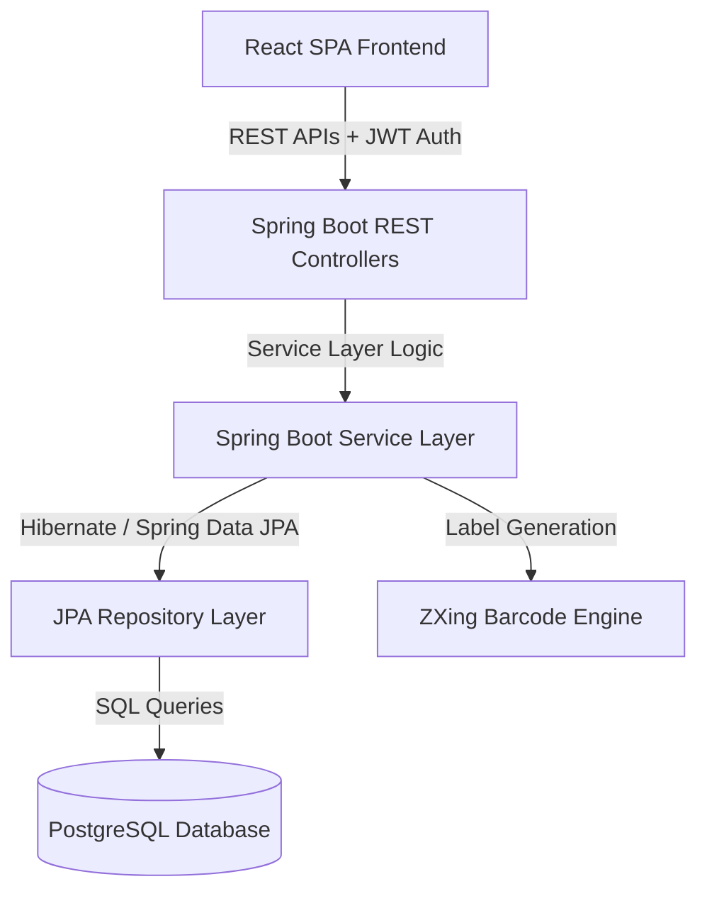
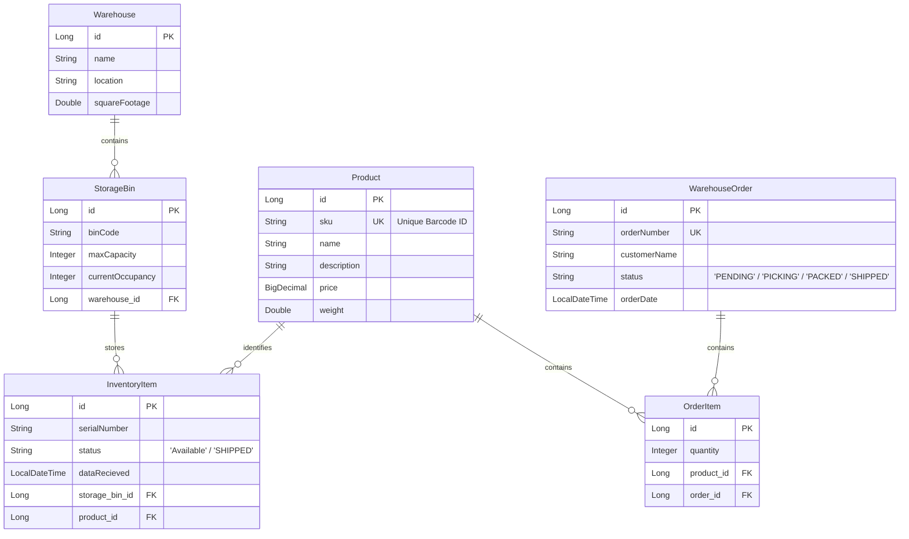
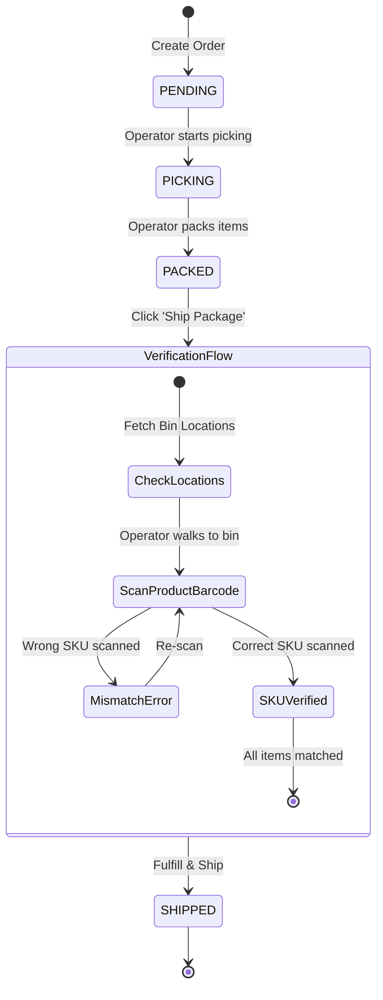

# WMS Project Interview Preparation Guide

This document acts as a comprehensive reference guide for your project, the **Enterprise Warehouse Management System (WMS)**. It is structured to help you confidently answer any architectural, implementation, or design questions during a technical interview.

---

## 💡 Project Elevator Pitch
> *"I built a real-time, secure Enterprise Warehouse Management System (WMS) that digitalizes warehouse logistics and automates stock tracking. The system manages the full lifecycle of goods—from arrival and shelf allocation to customer order placement, pick verification, and shipment. By integrating Code 128 barcodes for products and 2D QR codes for storage shelves, it enables operators to scan items using any device's webcam/camera to verify location placements and prevent fulfillment errors (e.g., shipping a wrong, identical-looking model)."*

---

## 🛠️ Architecture & Technology Stack

### 1. Frontend (React & Client Utilities)
* **React & Vite:** Single Page Application rendering dynamic metrics, forms, and order queues.
* **html5-qrcode:** Integrates with the browser's webcam APIs (`getUserMedia`) to decode barcodes/QR codes without requiring expensive external hardware.
* **Axios:** Handles asynchronous API requests, attaching JWT tokens automatically.
* **Lucide React:** Icon sets for professional, clean aesthetics.

### 2. Backend (Java & Spring Boot)
* **Spring Boot (Web, Security, Data JPA):** Exposes secure endpoints, configures role-based access control (Admin vs. Operator), and handles ORM mapping.
* **ZXing (Zebra Crossing):** Generates high-fidelity Code 128 (barcodes) and QR codes as PNG streams.
* **Jakarta Validation:** Implements backend verification constraints (`@NotBlank`, `@DecimalMin`, `@Size`, etc.).

### 3. Database (PostgreSQL)
* **PostgreSQL:** Reliable relational store managing constraints, transactions, and foreign keys.

---

## 🗄️ Database Schema & Relationships

---

## 🔄 Core Workflows & Logic

### 1. Inbound Flow (Receiving & Storing)
1. **Product Registration:** Operators register products in the system. The WMS generates a **Code 128 Product Barcode** using the product's unique SKU.
2. **Receiving Stock:** Boxes arrive, each with a unique **Serial Number** (for traceability) and the **Product SKU**.
3. **Shelf Allocation:** The operator walks to a physical shelf (e.g. `BIN-A1`), scans the **QR code sticker** on the shelf, and scans the item serial.
4. **WMS Action:** The database links the `InventoryItem` to that `StorageBin` and increments `currentOccupancy` on the bin, ensuring shelf limits aren't exceeded.

### 2. Outbound Flow (Orders & State Machine)
Orders progress through a strict, sequential state machine to guarantee transactional consistency:

### 3. Pick Verification Flow (Wrong-Pick Prevention)
When look-alike items (like *Metal Frame - Model A* vs. *Model B*) sit next to each other:
1. **Targeting Location:** The WMS checks where active inventory items for the target SKU are stored and tells the operator exactly where to go: *"Go to BIN-A1"*.
2. **Scan Check:** The operator grabs the item and scans the product barcode. 
3. **Backend/Frontend Check:** If they grabbed Model A (SKU-A) instead of Model B (SKU-B), the UI intercepts the scan and raises a warning: **"Wrong item! Put it back and pick Model B."**
4. **Fulfillment:** Only when the scanned SKU matches the target SKU does the system enable the "Fulfill & Ship" button. Upon execution:
   * Inventory items are marked `SHIPPED`.
   * The storage bin `currentOccupancy` decrements.
   * The item's storage bin relation is cleared (`null`).

---

## ⚠️ Database & Business Safeguards

1. **Unique SKU Validation:** Enforced both by PostgreSQL (`UNIQUE` constraint on `sku`) and the `ProductController` which intercepts duplicate SKU submissions, returning a custom error message.
2. **Storage Bin Capacity Limit:** Checks if `currentOccupancy >= maxCapacity` on receiving, throwing a custom `BinFullException` to block overflow.
3. **Atomic Shipments:** Order fulfillment queries all available items for a product SKU. If available units are fewer than ordered units, it rolls back the transaction and throws `InsufficientStockException`.

---

## 💬 Top Interview Q&As

### Q1: How does your system prevent human errors during the picking process?
> **Answer:** "Products that look identical, like different models of metal frames, are easily mixed up by operators. To prevent this, the WMS requires the operator to verify the item by scanning its barcode before shipment. The system guides the operator to the correct storage bin. When the operator scans the box barcode, the frontend compares it to the ordered SKU. If it doesn't match, the system locks the fulfillment button and warns: *'Wrong item! Put it back and pick Model [X]'*. The shipment is only completed when all SKU barcodes are correctly scanned."

### Q2: How did you implement barcode and QR scanning in a web browser without hardware scanners?
> **Answer:** "I integrated the open-source JavaScript library `html5-qrcode` in React. It utilizes the browser's `navigator.mediaDevices.getUserMedia` APIs to access the device camera. The library continuously captures video frames, processes them using canvas decoding, and returns the raw decoded text back to React states to automate forms or trigger validation."

### Q3: How does the system handle database consistency when shipping an order?
> **Answer:** "I utilized Spring's `@Transactional` annotation on the `updateOrderStatus` method. When an order transitions to `SHIPPED`, the system fetches available inventory items, decrements the occupied slots in their storage bins, disassociates the items from their bins, and updates the inventory statuses to `SHIPPED`. If any step fails (e.g., if another operator shipped the item concurrently or stock fell short), the entire transaction rolls back automatically, preventing database corruption."

### Q4: How are duplicate SKU entries handled?
> **Answer:** "SKUs are unique identifiers. I marked the `sku` field with `@Column(unique = true)` in the Hibernate entity so the database blocks duplicates. Additionally, the `ProductController` checks if the SKU already exists before saving and throws an `IllegalArgumentException`. A centralized `@ControllerAdvice` handler catches this exception and returns a clean `400 Bad Request` back to the frontend, showing a clear validation message to the operator."
